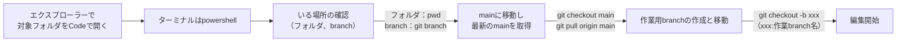
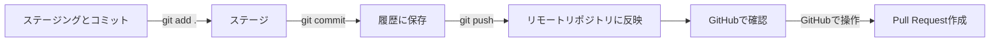
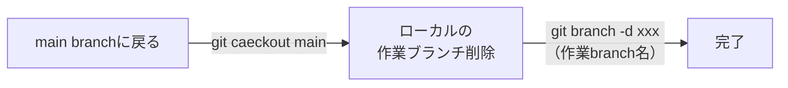
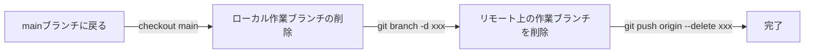

# Git王道シナリオ（編集中）

**編集開始前**



**編集後のマージ提案**



**作業後の処理手順**



## 作業開始前手順

- エクスプローラーで対象フォルダを開く。
  フォルダ内で右クリック → 「Code で開く」
- VSコード内、ターミナルをpowershellで開く。

```
初回のみ gitリポジトリかの確認（「今いるディレクトリがGitで管理されているかどうか」を確認するコマンド）
　git status

管理されていなかった場合、以下コマンドの実行（2回目以降は不要）
現在のディレクトリに .git フォルダが作成され、Gitの管理が始まる
　git init
```

- 現在のフォルダの確認

```
pwd
```

```
pwd実行後▼
path
C:\Users\KTC\develop\md-labo
※ これはmd-laboにいる状態
```

- フォルダを移動したい場合

```
cd .\md-labo
※ cd m～tab押下で変換される
```

```
いるフォルダを間違えて、Pull/Fetch/Clone実行すると・・
ホーム直下に大量のファイルが作られる。（ぶちまけ状態。）
⇒ 修正方法
1. エクスプローラーへ移動
2. 隠しフォルダを表示して、半透明の.gitを削除、誤マージファイル/フォルダを削除する。
◎今いる場所を把握しつつ何を実行するかが重要なポイント！
```

- 現在のbranchの確認

```
git branch または　git status
```

```
実行後▼
* xxx（xxx:作業branch名）
  main
※ 2つのbranchが存在し、* の場所にいる状態
```

- mainに移動しmain branchの最新状態を取得

```
　git checkout main
　git pull origin main
```

```
もし 他のmain以外のブランチにいる状態で git pull origin main を実行すると
main の内容が 現在のブランチにマージされてしまう。
```

- 最新のmainをベースに作業用branchの作成と移動

```
　git checkout -b xxx（xxx:作業branch名）
```

## 編集後のマージ提案

- 保存　⇒　ファイル名の横にMマークの確認　：Modified 変更済み
- 編集内容をadd .してcommitする

```
git add .
git commit -m "接頭辞：作業内容の説明"
```

- GitHub上にpushして反映させる

```
git push origin xxx
```

- GitHub上でPull Request（PR）を作成
  ⇒ GitHub上の画面で「Compare & pull request」でマージ提案
- ファイル横の文字リスト

| Initial | Word             | 意味                                     |
| ------- | ---------------- | ---------------------------------------- |
| M       | Ｍｏｄｉｆｉｅｄ | 既存ファイルが編集された                 |
| U       | Ｕｎｍｅｒｇｅｄ | マージ時の競合が解決されていない△要注意 |
| A       | Ａｄｄｅｄ       | 新しく追加されたファイル                 |
| D       | Ｄｅｌｅｔｅｄ   | 削除されたファイル                       |
| R       | Ｒｅｎａｍｅｄ   | リネームされたファイル                   |
| C       | Ｃｏｐｉｅｄ     | コピーされたファイル                     |

## 作業完了後の処理

- main branchに戻る

```
git checkout main
```

- ローカルの作業ブランチ削除

```
git branch -d xxx(作業branch名)
```

- リモート上の作業ブランチも削除できる（不要な場合）
1.この操作の目的
作業が完了したブランチを整理することで、リポジトリをクリーンに保つ。
他のメンバーが不要なブランチを参照するのを防ぐ。
2.注意点
リモートからブランチを削除するため、そのブランチの使用有無を確認する。

```
git push origin --delete xxx
```
*作業完了後フロー*


