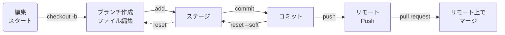

# Gitコマンドチートシート
#### 基本の編集フロー

```mermaid
flowchart LR
    id1(編集<br>スタート)
    id2[ブランチ作成<br>ファイル編集]
    id3[ステージ]
    id4[コミット]
    id5[リモート<br>Push]
    id6[リモート上で<br>マージ]
    id1 -->|checkout -b| id2
    id2 -->|add| id3
    id3 -.->|reset| id2
    id3 -->|commit| id4
    id4 -->|push| id5
    id5 -->|pull request| id6
    id4 -->|reset --soft| id3

```

git revert HEAD

Git reset ステージングの取り消し
git reset --soft HEAD^　直前のコミットの取り消し（ファイルの変更内容はそのまま）
git reset --hard HEAD^　直前のコミットの取り消し（ファイルの変更内容も取り消す）