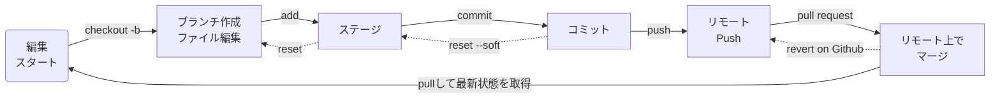

# Gitコマンドチートシート

### 基本の編集フロー



### コマンドチートシート

#### リモートリポジトリ設定系

- リモートリポジトリを設定する(設定したいディレクトリに移動して実行すること)

  - URLはGitHub上で確認してください
    ```
    コマンド
    $ git remote add origin http://xxxxxx.xxx/xxxx
    ```
- リモートリポジトリを確認する

  ```
  コマンド
  $ git remote -v
  ```

  ```
  結果
  > origin  git@github.com:shinkawa1209/md-labo.git (fetch)
  > origin  git@github.com:shinkawa1209/md-labo.git (push)
  ```
- リモートリポジトリから、コードを取得（Clone）する

  ```
  コマンド
  $ git clone http://xxxxxx.xxx/xxxx
  ```
- ローカルリポジトリとリモートリポジトリを同期（Pull）する

  - リモートリポジトリの内容を取得（fetch）し、ローカルリポジトリを更新（merge）する
    ```
    コマンド
    $ git pull
    ```
  - リモートリポジトリの内容を取得（fetch）する。ローカルリポジトリへのmergeはしない
    ```
    コマンド
    $ git fetch
    ```

#### ブランチ操作系

- ローカルで編集用のBranchを作成する

  ```
  コマンド
  $ git checkout -b [ブランチ名を入力]
  ```
- ローカルで現在のBranchを確認する

  ```
  コマンド
  $ git branch
  ```

  ```
  結果
  > * addGitcomandCheetsheet
  >   edit
  >   main
  >   shinkawa-edit
  ```
- ローカルでBranchを移動する

  ```
  コマンド
  $ git checkout [ブランチ名を入力]
  ```
- ローカルでBranchを削除する

  ```
  コマンド
  $ git branch -d [ブランチ名]
  ```

  - 上のコマンドは、マージ済のブランチのみ削除可能
  - 未マージのブランチを削除したい場合は以下のコマンド
    ```
    コマンド
    $ git branch -D [ブランチ名]
    ```
- リモートのBranchを削除する

  ```
  コマンド
  $ git push origin --delete [ブランチ名]
  ```
- リモートとローカルのBranchの差を解消する

  - GithubはPullRequastをMergeすると、Branchは自動で消えますが、ローカルには残ってしまいます。定期的に以下のコマンドでクリアしましょう。
  - リモート上のBranchの状態を確認する
    ```
    コマンド
    $ git remote show origin
    ```
  - stale状態（Trackされてない）Branchをローカルから削除（prune）する
    ```
    コマンド
    $ git remote prune origin
    ```

#### ファイル編集系

- リモートリポジトリの内容を取得（fetch）する

  ```
  コマンド
  $ git fetch
  ```
- 現在のステージ、コミットの状態を確認する

  ```
  コマンド
  $ git status
  ```

  ```
  結果（ファイルの更新が無い場合）
  > On branch addGitcomandCheetsheet
  > Your branch is up to date with 'origin/addGitcomandCheetsheet'.

  > nothing to commit, working tree clean
  ```

  ```
  結果（ステージされていないファイルがある場合）
  > On branch addGitcomandCheetsheet
  > Your branch is up to date with 'origin/addGitcomandCheetsheet'.

  > Changes not staged for commit:
      (use "git add <file>..." to update what will be committed)
      (use "git restore <file>..." to discard changes in working directory)
          modified:   "Gitコマンドチートシート.md"
  ```

  ```
  結果（コミットされていないファイルがある場合）
  > On branch addGitcomandCheetsheet
  > Your branch is up to date with 'origin/addGitcomandCheetsheet'.

  > Changes to be committed:
  > (use "git restore --staged <file>..." to unstage)
      modified:   "Gitコマンドチートシート.md"
  ```
- 編集内容をステージ（add）する

  ```
  コマンド
  $ git add [ファイル名]
  ```

  - 全ての変更をステージする場合[ファイル名]の箇所を[.]で指定する
- ステージ（addしたこと）を取り消す

  ```
  コマンド
  $ git reset
  ```
- ステージ（add）したことをローカルでコミット（commit）する

  ```
  コマンド
  $ git commit -m [このコミットのタイトルを入力]
  ```
- コミット（commit）したことをローカルで取り消す

  ```
  コマンド（ファイルの内容は元に戻さない）
  $ git reset --soft HEAD^
  ```

  ```
  コマンド（ファイルの変更内容も含めて取り消す）
  $ git reset --hard HEAD^
  ```

  - HEAD^ は直前のという意味です。HEAD^^とすると二個前を取り消します。
  - HEADの部分を[commit ID]で指定することで、そのコミットを取り消すことも出来ます。
- コミット（commit）したことをローカル内で打ち消すコミットを実行する

  ```
  コマンド
  $ git revert HEAD
  ```

  - revertは直前の更新を取り消したものをコミットする（履歴の残る）方法です。
  - 対し、reset はコミット自体を消し、無かったことにする方法です。
  - ローカル上で編集しているウチは、どちらを使っても良いですが、リモートにPushした後の修正は、関係者に取り消しの事実を共有するためにrevertを使うことが推奨されます。
- ローカルのコミット内容をリモートに転送（Pushする）

  ```
  コマンド
  $ git push origin (必要に応じてBranch名を入力)
  ```
- ローカルで新規作成したBranchをリモートに転送（Pushする）

  - 新規作成したBranchはリモート上には存在しないので以下のオプションを付けて実行
    ```
    コマンド
    $ git push --set-upstream origin [新規作成したBranch名]
    ```
- Pushの取り消し

  - Pushを取り消すコマンド自体はないので、ローカル内でPushした内容をrevertして、revertされた内容を再度Pushする  
  
- ファイル編集後にVScode上に表示されるマークの意味

| Initial | Word             | 意味                                     |
| ------- | ---------------- | ---------------------------------------- |
| M       | Ｍｏｄｉｆｉｅｄ | 既存ファイルが編集された                 |
| U       | Ｕｎｍｅｒｇｅｄ | マージ時の競合が解決されていない△要注意 |
| A       | Ａｄｄｅｄ       | 新しく追加されたファイル                 |
| D       | Ｄｅｌｅｔｅｄ   | 削除されたファイル                       |
| R       | Ｒｅｎａｍｅｄ   | リネームされたファイル                   |
| C       | Ｃｏｐｉｅｄ     | コピーされたファイル                     |

#### Githubの操作編

- 工事中
- 工事中
- 工事中
- 工事中
- 工事中
