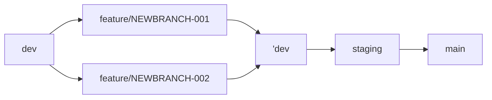

# Gitブランチ運用ルールについて

## これは何の話？

Githubを使って複数人で作業を進めるにあたり、ブランチルールを定める

## 基本ルール

以下のブランチを使い分けてコードを管理する

### main：本番運用（マスターコード）

stagingブランチからのみプルリクエストを作成する

### staging：ステージング環境（本番ミラーテスト用）

devブランチからのみプルリクエストを作成する

### dev：開発環境

基本の開発環境。このブランチからfeature/xxxxxブランチを作成する

### feature/NEWBRANCH：作業用ブランチ

- 作業時に、dev環境から作業用ブランチを切り出して作成し、修正作業を実施する
  - 同様のチケットで複数作業をする場合は `feature/NEWBRANCH-xx`のように後ろに数字をつける
  - ただし、基本的に同じチケットに複数の作業を盛り込みすぎず、チケットを分解できるように粒度を調整する

## ローカル開発環境

### 作業イメージ

### コミットの粒度とプルリクエストの取り扱いについて

#### コミットメッセージ

- 各コミットにはコミットのカテゴリごとに下記の接頭辞をつけたメッセージを付与すること
- 例）「feat:○○機能を追加」など

| 接頭辞   | 内容                                                                                                     |
| -------- | -------------------------------------------------------------------------------------------------------- |
| feat     | 新機能の追加・新規の編集（他に該当が無い場合は基本的にfeatを付ける                                       |
| fix      | 不具合の修正                                                                                             |
| docs     | ドキュメントやコメントのみ修正                                                                           |
| style    | コードの処理に影響しない変更（スペースやインテント調整や書式設定、セミコロン、コードブロックの整理など） |
| refactor | バグ修正や、機能の追加をしない、コードの変更や最適化                                                     |
| perf     | パフォーマンス改善を目的としたコードの変更                                                               |
| test     | テストの項目漏れや、既存のテスト修正                                                                     |
| chore    | ドキュメント追加やビルドプロセス、ライブラリ変更、CI/CDパイプラインの修正                                |
| design   | cssなどのUI/見た目だけの修正                                                                             |
| delete   | 不要なファイルの削除のみ                                                                                 |

#### コミットのタイミング

- タスク単位でコミットする
- 最小の機能単位でレビューに出す（タスクも出来るだけ最小単位で作成する）
- 「管理機能追加」ではなく、「一覧ページの表示機能」「登録機能追加」など、CRUD単位で切り出す

#### 例）新規CRUD機能の実装の場合

- 登録機能で1プルリク
- 削除機能で1プルリク
- 更新機能で1プルリク
- 一覧画面表示で1プルリク
- 削除機能で1プルリク

#### プルリクエストの名称

- 原則、一目で何を対応したのかがわかる　ようなコメントを付ける
  - 例）ユーザーの新規登録機能の実装

#### プルリクエストのマージ

- プルリクエストはレビュアーに対してレビューを依頼する
- マージはレビュアーが行う
- マージされたfeatureブランチは削除する（devやstagingを削除しないように気を付ける）

#### stagingおよびmainへのマージのタイミング

- 一連のタスクが完了し、レビューが完了した時点でマージを行う
- mainへの反映＝本番リリース　なので、mainへの反映は基本的にリリースタイミング以外でマージは発生しない

#### テスト実施

- 単体テスト、結合テストはdevブランチのコードで実施する
- featureでコードレビュ->devにマージ->テストの実施という流れとする
