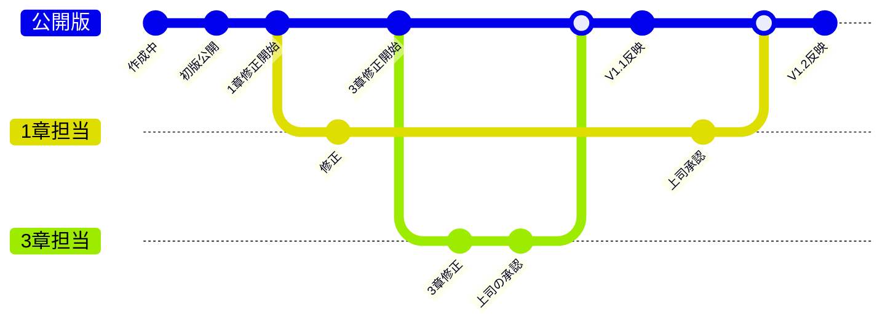
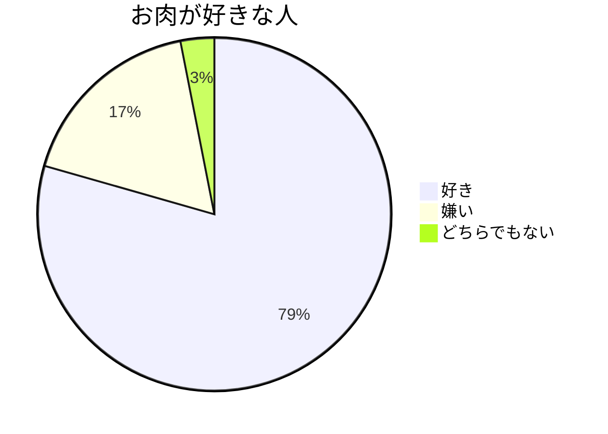

<!--
################################################################
これは、Markdown記法で文書を作成するサンプルです。
必要な環境と設定↓
・VSCode
参考：https://yaspage.com/vscode-install/
・その他のMarkdownを操作するための拡張機能
https://qiita.com/ourinhu269/items/af1e2b4d7fb71a78aef3#4%E7%AB%A0-%E3%81%8A%E3%81%99%E3%81%99%E3%82%81%E3%81%AE%E6%8B%A1%E5%BC%B5%E6%A9%9F%E8%83%BD
★普通にPDFで出力するとMermaidの図は表示されません。HTMLはOK。
→　↑を解決するには、
　　１．拡張機能「Markdown Preview Enhanced」を追加
　　２．プレビュー画面上で右クリック＞Export＞Chrome (Puppeteer)＞PDF　これで解決
　　※参考：https://labor.ewigleere.net/2024/03/17/convert-docs-created-with-mermaidjs-on-vscode-to-pdf/
################################################################
-->

<!-- ここからスライドの本体 -->
---
# Title：サンプル資料
- 作成日：yyyy月mm月dd日
- 部署：サンプル部署
- 作成者：shinkawa

---
# Markdown資料作成のメリット
- とにかく簡単 　　　　　　　　　 テキストエディタだけ
- 実態はただのテキストファイル　　軽量
- 内容と見た目を分離　　　　　　　内容を考えることに集中できる
- 使いまわせる　　　　　　　　　　内容だけを書き換えやすい
- コードで管理　　　　　　　　　　執筆→校正→校了→発行がコードで管理可能

---
# なぜパワポやエクセルWordじゃないのか？
- OfficeソフトはWYSIWYG "**W**hat **Y**ou **S**ee **I**s **W**hat **Y**ou **G**et"(見たままが得られる)特徴
  - これはメリットでもあるが、操作を覚えるのが大変。ボタンが多い。
- １枚１枚のスライド毎にデザインの調整が可能
  - これもメリットだが逆を返せば1枚1枚レイアウトやトーンを統一する操作が必要で作業量が多い
- 図形の配置や見た目の意味など、情報の次元が高い
  - 次元が高い分、検討と作成作業量が多い

<span style= "color: red; font-size: 20px;">伝えたいメッセージを考える時間と<br>見た目を整える時間が<br>同じくらい必要な特徴があります。</span>

---
# メリデメのまとめ
|  | メリット | デメリット |
| ------ | -------- | -------- |
| Markdown   |- シンプル・軽量<br>- 見た目の統一感<br>- マウスが不要<br>- 更新が効率的|- 細かなデザインは大変<br>- ワクワクしない<br>- 操作が直観的ではない<br>- 複雑なデザインは難しい|
| PowerPoint   |- 細部までデザイン出来る<br>- 様々なデザインに対応<br>- 操作が直観的<br>- 見たままを出力出来る|- デザインを考える時間が必要<br>- 1枚1枚のデザインの調整が必要<br>- ボタンと機能を覚える必要がある<br>- ピクセル単位でレイアウトの調整が必要|

---
# MarkDownドキュメントが向いているもの
1. 見た目にかける時間より、メッセージを考える時間を優先したいとき
2. 設計書やパラメータ値など更新と管理が必要なドキュメントの場合
3. イメージじゃなく、情報やメッセージを伝えたいとき
## ドキュメント更新のプロセスイメージ
テキストファイルなので、Gitでバージョン管理が可能です。



---

# この資料の文字量
この資料の実体↓80行くらいのテキストだけで構成されてます。
```
---
# Title：サンプル資料
- 作成日：yyyy年mm月dd日
- 部署：サンプル部署
- 作成者：shinkawa

---
# Markdownプレゼンテーション資料作成のメリット
- とにかく簡単 　　　　　　　　　 テキストエディタだけ
- 実態はただのテキストファイル　　軽量
- 内容と見た目を分離　　　　　　　内容を考えることに集中できる
- 使いまわせる　　　　　　　　　　内容だけを書き換えやすい
- コードで管理　　　　　　　　　　執筆→校正→校了→発行がコードで管理可能

---
# なぜパワポじゃダメなのか？
- WYSIWYG "**W**hat **Y**ou **S**ee **I**s **W**hat **Y**ou **G**et"(見たままが得られる)特徴
```

---
# おわりに
まとめ
- イメージを伝えたり、ワクワクさせるような話をする際はパワポ
- メッセージが明確で、しっかり伝えたいときはMarkDownも活用してみてはいかがでしょうか
- どちらもメリットのあるテクニックなので、時と場合によって使い分けられるようにどちらも習得してみましょう！

---
# サンプルおしまい

---
# 基本記法の説明
`見出し（＃の後に半角スペースが無いと有効にならないので注意`
# 見出し１
## 見出し２
### 見出し３
#### 見出し４
##### 見出し５
###### 見出し６

---
# 基本記法の説明
`---　で水平線が引ける。ページの区切りに活用`

`- でリスト、1.で番号リスト※要半角スペース`
- リスト１
  - 入れ子１
  - 入れ子２
- リスト２
1. 番号１
2. 番号２

---
# 基本記法の説明
`> で引用表示`
> 引用です。
> 半角スペースを忘れないでください。
>> 二重引用もできます。
>>　あああああ 

` ```でコードブロック表示 `
```
コードブロックです。```　～　```の間が囲われます。
キーボードのShift＋＠キーです。７の奴は違うので注意
```

---
# 基本記法の説明
`水平罫線は<hr>タグでも書けます`
<hr>

- `*xxx*` *斜体*
- `**xxx**` **強調**
- `***xxx***` ***強調斜体***
- `~~xxx~~` ~~取り消し線~~

---
# 基本記法の説明
`画像を表示する`


`リンクを表示する`
[マークダウン記法サンプル](https://qiita.com/tbpgr/items/989c6badefff69377da7)

---
# 基本記法の説明
`文字色はHTMLタグを使います`
```
<span style="color: red;">赤色テキスト</span>
```
<span style="color: red;">赤色テキスト</span>
```
<span style="color: green;">緑色テキスト</span>
```
<span style="color: green;">緑色テキスト</span>
<span style="color: Blue; font-size:20px;">青色も大きくも出来ます</span>

---
# Mermaidの利用
Mermaidの利用も可能です。が、VSCodeForMARPで利用する際は設定が必要です。
- 上手く表示されない場合は、右上･･･から「プレビューのセキュリティ設定を変更」から無効を選択してみる
- ダメならVSCodeを閉じて、再度開いてみる。これでダメならお手上げ。
[参考リンク](https://zenn.dev/sutobu000/scraps/93f3d60ad4cea6)

---
# Mermaidの描画例
`ここにコードが表示されている場合は、プレビューを更新してください`


---
# おしまい
