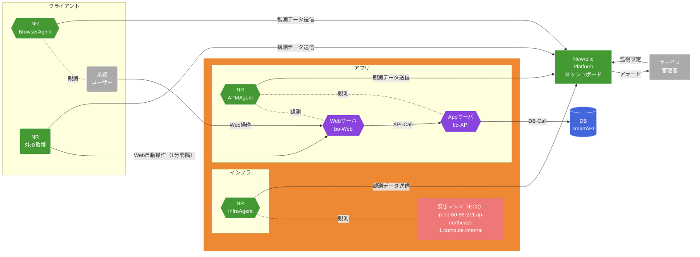

## SG管理画面の監視構成
・緑のアイコンをクリックすると、各ダッシュボードへ移動します。
・紫のアイコンは有償ユーザーのみ閲覧可能です。

```mermaid
flowchart LR

%%オブジェクトの定義
OU1(業務<br>ユーザー)
NR4{{NR<br>BrowserAgent}}
NR1(NR<br>外形監視)
APP1{{Webサーバ<br>bo-Web}}
APP2{{Appサーバ<br>bo-API}}
CP1[仮想マシン（EC2）<br>ip-10-50-88-211.ap-northeast-1.compute.internal]
DB1[(DB<br>smartAPI)]
NR2{{NR<br>InfraAgent}}
NR5{{NR<br>APMAgent}}
subgraph bo-EC2[bo-EC2]
    subgraph Inf0[インフラ]
        NR2
    end
    subgraph APP0[アプリ]
        APP1
        APP2
        NR5
    end
    CP1
end

subgraph Client[クライアント]
    NR4
    OU1
    NR1
end

NR3[Newrelic<br>Platform<br>ダッシュボード]
OU2[サービス<br>管理者]

%%オブジェクトの連関
NR1 ---->|Web自動操作（1分間隔）| APP1
NR1 ---->|観測データ送信| NR3
NR4　-.- |観測| OU1
OU1-->|Web操作| APP1　
NR4 ---->|観測データ送信| NR3
APP1 -->|API-Call| APP2
APP2 -->|DB-Call| DB1
DB1
NR5 -.-|観測| APP1
NR5 -.-|観測| APP2
NR5 ---->|観測データ送信| NR3
NR2 -..-|観測| CP1
NR2 ---->|観測データ送信| NR3
OU2 -->|監視設定| NR3
NR3 -->|アラート| OU2

click NR1 href "https://onenr.io/0ERzGNdpljr" "外形監視ダッシュボード"
click NR2 href "https://onenr.io/0gR7Jx2rXwo" "EC2ダッシュボード" _blank
click NR3 href "https://onenr.io/0EjO0y8D0Q6" "サマリダッシュボード" _blank
click NR4 href "https://onenr.io/08jqBN4VdQl" "ブラウザダッシュボード" _blank
click NR5 href "https://onenr.io/0gR7Jx2rKwo" "アプリダッシュボード" _blank
click DB1 href "https://onenr.io/07wkLDMP0RL" "DBダッシュボード" _blank

click APP1 href "https://onenr.io/0Bj3Jz2MdRX" "bo-web-APM" _blank
click APP2 href "https://onenr.io/0gR7Jx2lXwo" "bo-api-APM" _blank
click CP1 href "https://onenr.io/08wpk1DMeQO" "管理画面-インフラAgent" _blank

%%================================================================
%%---アイコンスタイルの設定---

%%外部要素のスタイル（灰色）
%% [ ]か( )で名前を括る
classDef SOU fill:#aaa,color:#fff,stroke:#fff
class OU1,OU2,OU3 SOU

%%Network関連のスタイル（紫）
%% {{ }}か[ ]で名前を括る
classDef SNW fill:#84d,color:#fff,stroke:none
class APP1,APP2,NW3 SNW

%%Compute関連のスタイル（オレンジ）
%% ( )で名前を括る
classDef SCP fill:#e77,color:#fff,stroke:none
class CP1,CP2,CP3 SCP

%%DB関連のスタイル（青）
%%[( )]で名前を括る
classDef SDB fill:#46d,color:#fff,stroke:#fff
class DB1,DB2,DB3 SDB

%%NRとStorage関連のスタイル（緑スタイル）
%%[( )]で名前を括る
classDef SST fill:#493,color:#fff,stroke:#fff
class NR1,NR2,NR3,NR4,NR5,NR6,ST1 SST

%%---グループスタイルの設定---

%%Public subnetのスタイル
%%[ ]で名前を括る
classDef SGPuS fill:#efe,color:#092,stroke:none
class GS SGPuS

%%EC2のスタイル
%%[ ]で名前を括る
classDef EC2 fill:#e83,color:#e83,stroke:#fff
class bo-EC2 EC2


%%AWS Cloudのスタイル
%% [ ]で名前を括る
classDef SGC fill:none,color:#345,stroke:#345
class GC SGC

%%Regionのスタイル
%% [ ]で名前を括る
classDef SGR fill:none,color:#59d,stroke:#59d,stroke-dasharray:3
class GR SGR

%%VPCのスタイル
%% [ ]で名前を括る
classDef SGV fill:none,color:#0a0,stroke:#0a0
class GV SGV

%%Availability Zoneのスタイル
%% [ ]で名前を括る
classDef SGA fill:none,color:#59d,stroke:#59d,stroke-width:1px,stroke-dasharray:8
class GA SGA

%%Private subnetのスタイル
%% [ ]で名前を括る
classDef SGPrS fill:#def,color:#07b,stroke:none
class GS1,GS2 SGPrS


%%================================================================

```