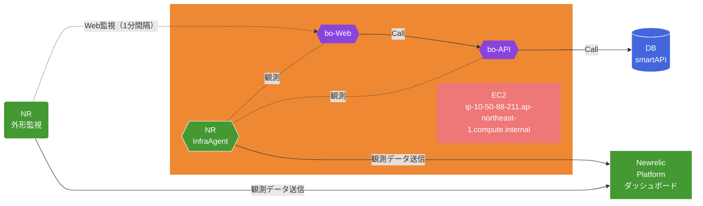

監視の構成（リンク先は各ページです）

```mermaid
flowchart LR

%%オブジェクトの定義
NR1(NR<br>外形監視)
APP1{{bo-Web}}
APP2{{bo-API}}
CP1[EC2<br>ip-10-50-88-211.ap-northeast-1.compute.internal]
DB1[(DB<br>smartAPI)]
NR2{{NR<br>InfraAgent}}
subgraph bo-EC2[bo-EC2]
    APP1
    APP2
    CP1
    NR2
 end
 NR3[Newrelic<br>Platform<br>ダッシュボード]

NR1 -...->|Web監視（1分間隔）| APP1
APP1 -->|Call| APP2
APP2 -->|Call| DB1
DB1
NR2 -.-|観測| APP1
NR2 -.-|観測| APP2
NR2 ---->|観測データ送信| NR3
NR1 -->|観測データ送信| NR3

click NR1 href "https://onenr.io/0EjOB5GnGR6" "外形監視ダッシュボード" _blank
%%click APP1 href "https://onenr.io/0dQeDlAodje" "APMダッシュボード" _blank
%%click APP2 href "https://onenr.io/0dQeDlAodje" "APMダッシュボード" _blank
click DB1 href "https://onenr.io/0dQeDlAodje" "APMダッシュボード" _blank
click CP1 href "https://onenr.io/0qQaVMWgVw1" "EC2" _blank

%%================================================================
%%---アイコンスタイルの設定---

%%外部要素のスタイル（灰色）
%% [ ]か( )で名前を括る
classDef SOU fill:#aaa,color:#fff,stroke:#fff
class OU1,OU2,OU3 SOU

%%Network関連のスタイル（紫）
%% {{ }}か[ ]で名前を括る
classDef SNW fill:#84d,color:#fff,stroke:none
class APP1,APP2,NW3 SNW

%%Compute関連のスタイル（オレンジ）
%% ( )で名前を括る
classDef SCP fill:#e77,color:#fff,stroke:none
class CP1,CP2,CP3 SCP

%%DB関連のスタイル（青）
%%[( )]で名前を括る
classDef SDB fill:#46d,color:#fff,stroke:#fff
class DB1,DB2,DB3 SDB

%%Storage関連のスタイル（緑スタイル）
%%[( )]で名前を括る
classDef SST fill:#493,color:#fff,stroke:#fff
class NR1,NR2,NR3,ST1 SST

%%---グループスタイルの設定---

%%Public subnetのスタイル
%%[ ]で名前を括る
classDef SGPuS fill:#efe,color:#092,stroke:none
class GS SGPuS

%%EC2のスタイル
%%[ ]で名前を括る
classDef EC2 fill:#e83,color:#e83,stroke:#fff
class bo-EC2 EC2


%%AWS Cloudのスタイル
%% [ ]で名前を括る
classDef SGC fill:none,color:#345,stroke:#345
class GC SGC

%%Regionのスタイル
%% [ ]で名前を括る
classDef SGR fill:none,color:#59d,stroke:#59d,stroke-dasharray:3
class GR SGR

%%VPCのスタイル
%% [ ]で名前を括る
classDef SGV fill:none,color:#0a0,stroke:#0a0
class GV SGV

%%Availability Zoneのスタイル
%% [ ]で名前を括る
classDef SGA fill:none,color:#59d,stroke:#59d,stroke-width:1px,stroke-dasharray:8
class GA SGA

%%Private subnetのスタイル
%% [ ]で名前を括る
classDef SGPrS fill:#def,color:#07b,stroke:none
class GS1,GS2 SGPrS


%%================================================================

```