AWSアイコンを呼び出す版
```mermaid
flowchart LR

internet@{img: "https://api.iconify.design/material-symbols/globe-asia.svg",label: "internet",pos: "b",w: 60,h: 60,constraint: "on"}

subgraph aws["aws(ap-northeast-1)"]
  subgraph vpc-vvvv1["vpc:v1"]
    subgraph group-1-vpc-vvvv1[" "]
      elb-xxxx1@{img: "https://api.iconify.design/logos/aws-elb.svg",label: "elb:<br>test_elb",pos: "b",w: 60,h: 60,constraint: "on"}
    end
    subgraph group-2-vpc-vvvv1[" "]
      ec2-i-xxxx1@{img: "https://api.iconify.design/logos/aws-ec2.svg",label: "ec2:<br>admin",pos: "b",w: 60,h: 60,constraint: "on"}
      ecs-cluster/api1@{img: "https://api.iconify.design/logos/aws-ecs.svg",label: "ecs:<br>cluster/api",pos: "b",w: 60,h: 60,constraint: "on"}
    end
    subgraph group-3-vpc-vvvv1[" "]
      rds-xxxx1@{img: "https://api.iconify.design/logos/aws-rds.svg",label: "rds:<br>xxxx",pos: "b",w: 60,h: 60,constraint: "on"}
    end
  end
  subgraph group-4[" "]
     s3-xxxx1@{img: "https://api.iconify.design/logos/aws-s3.svg",label: "s3:<br>xxxx",pos: "b",w: 60,h: 60,constraint: "on"}
  end
end

group-1-vpc-vvvv1 ~~~ group-2-vpc-vvvv1 ~~~ group-3-vpc-vvvv1 ~~~ group-4

internet ----- |"admin.test.co.jp"| elb-xxxx1 --- ec2-i-xxxx1
internet ----- |"api.test.co.jp"| elb-xxxx1 --- ecs-cluster/api1

click ec2-i-xxxx1 href "https://aws.amazon.com/" _blank
click ecs-cluster/api1 href "https://aws.amazon.com/" _blank
click elb-xxxx1 href "https://aws.amazon.com/" _blank
click rds-xxxx1 href "https://aws.amazon.com/" _blank
click s3-xxxx1 href "https://aws.amazon.com/" _blank

classDef default fill:#fff
style aws fill:#fff,color:#345,stroke:#345
classDef group fill:none,stroke:none
classDef vpc fill:#fff,color:#0a0,stroke:#0a0
class vpc-vvvv1 vpc
class group-1-vpc-vvvv1,group-2-vpc-vvvv1,group-3-vpc-vvvv1,group-4 group

```

```mermaid
architecture-beta
        group vpc[VPC]
    
        service elb(logos:aws-elb)[ELB] in vpc
    
        group availabilityzone[Availability Zone ap northeast 1a] in vpc
        group availabilityzone2[Availability Zone ap northeast 1c] in vpc
    
    
        group publicsubnet[Public subnet] in availabilityzone
        group publicsubnet2[Public subnet] in availabilityzone2
    
        service ec2a(logos:aws-ec2)[EC2]in publicsubnet
        service ec2b(logos:aws-ec2)[EC2] in publicsubnet2
    
        group privatesubnet[Private subnet] in availabilityzone
        group privatesubnet2[Private subnet] in availabilityzone2 
    
        service rds(logos:aws-rds)[RDS master] in privatesubnet
        service rds2(logos:aws-rds)[RDS slave] in privatesubnet2
    
    
        elb:B --> T:ec2a
        elb:B --> T:ec2b
        ec2a:B --> T:rds
        ec2b:B --> R:rds
```


