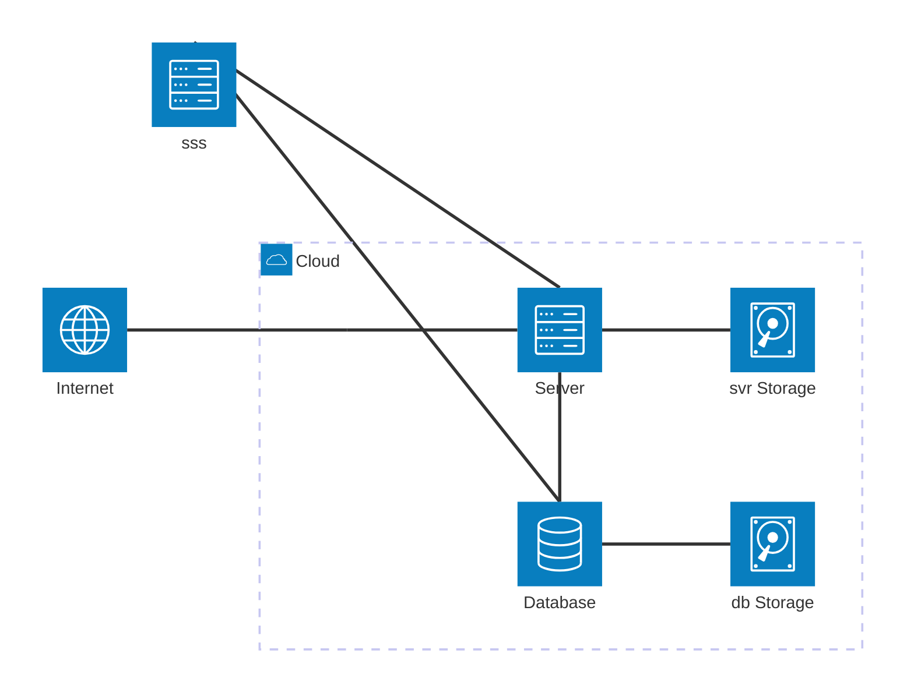
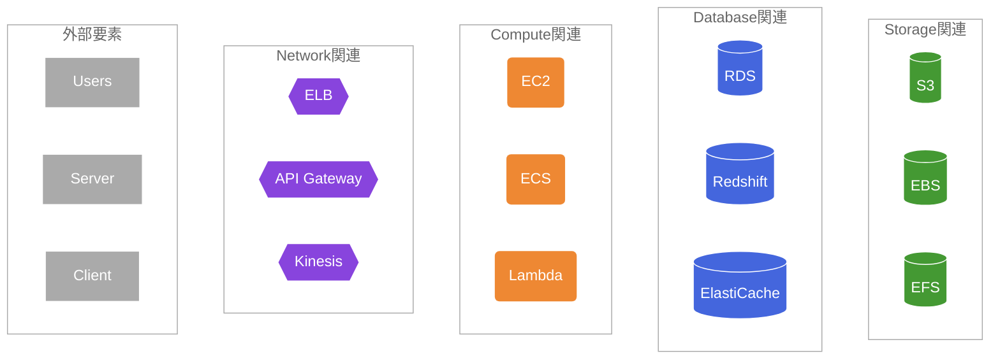

```mermaid
architecture-beta

    service internet(internet)[Internet]

    group cloud(cloud)[Cloud]

    service server(server)[Server] in cloud
    service db(database)[Database] in cloud
    service svdisk(disk)[svr Storage] in cloud
    service dbdisk(disk)[db Storage] in cloud
    junction jct in cloud

    service server1(server)[sss] 

    internet:R -- L:jct
    jct:R -- L:server
    server:B -- T:db
    server:R -- L:svdisk
    db:R -- L:dbdisk

    server:T -- T:server1
    db:T -- T:server1

```

インスタンスの部品

```mermaid
flowchart

%%---グループの設定---

%%Storage関連のグループ
subgraph GST[Storage関連]
  ST1[(S3)]
  ST2[(EBS)]
  ST3[(EFS)]
end

%%Database関連のグループ
subgraph GDB[Database関連]
  DB1[(RDS)]
  DB2[(Redshift)]
  DB3[(ElastiCache)]
end

%%Compute関連のグループ
subgraph GCP[Compute関連]
  CP1(EC2)
  CP2(ECS)
  CP3(Lambda)
end

%%Network関連のグループ
subgraph GNW[Network関連]
  NW1{{ELB}}
  NW2{{API Gateway}}
  NW3{{Kinesis}}
end

%%外部要素のグループ
subgraph GOU[外部要素]
  OU1[Users]
  OU2[Server]
  OU3[Client]
end

%%---スタイルの設定---

%%外部要素のスタイル
classDef SOU fill:#aaa,color:#fff,stroke:#fff
class OU1,OU2,OU3 SOU

%%Network関連のスタイル
classDef SNW fill:#84d,color:#fff,stroke:none
class NW1,NW2,NW3 SNW

%%Compute関連のスタイル
classDef SCP fill:#e83,color:#fff,stroke:none
class CP1,CP2,CP3 SCP

%%DB関連のスタイル
classDef SDB fill:#46d,color:#fff,stroke:#fff
class DB1,DB2,DB3 SDB

%%Storage関連のスタイル
classDef SST fill:#493,color:#fff,stroke:#fff
class ST1,ST2,ST3 SST

%%グループのスタイル
classDef SG fill:none,color:#666,stroke:#aaa
class GST,GDB,GCP,GNW,GOU SG

```

グループの部品

```mermaid
flowchart

%%---グループの設定---

%%Public subnetのグループ
subgraph GS1[Public subnet]
end

%%Private subnetのグループ
subgraph GS2[Private subnet]
end

%%Availability Zoneのグループ
subgraph GA[Availability Zone]
end

%%VPCのグループ
subgraph GV[VPC]
end

%%Regionのグループ
subgraph GR[Region]
end

%%AWS Cloudのグループ
subgraph GC[AWS Cloud]
end

%%---スタイルの設定---

%%AWS Cloudのスタイル
classDef SGC fill:none,color:#345,stroke:#345
class GC SGC

%%Regionのスタイル
classDef SGR fill:none,color:#59d,stroke:#59d,stroke-dasharray:3
class GR SGR

%%VPCのスタイル
classDef SGV fill:none,color:#0a0,stroke:#0a0
class GV SGV

%%Availability Zoneのスタイル
classDef SGA fill:none,color:#59d,stroke:#59d,stroke-width:1px,stroke-dasharray:8
class GA SGA

%%Private subnetのスタイル
classDef SGPrS fill:#def,color:#07b,stroke:none
class GS2 SGPrS

%%Public subnetのスタイル
classDef SGPuS fill:#efe,color:#092,stroke:none
class GS1 SGPuS
```