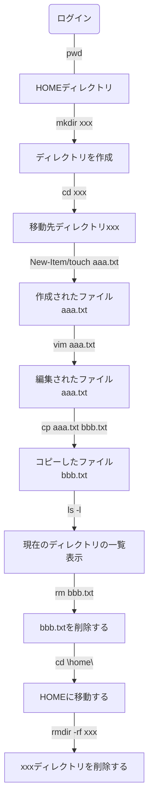

# コマンドライン操作を覚えよう

## はじめに

### Windowsの登場に伴い、近年のパソコンはGUI（Graphical User Interface）が主流になりました。

- 複数の画面を同時に表示（ウィンドウを開いたり閉じたり重ねたり）して、直観的な操作が出来る

### Windows以前のコンピュータは、コマンドラインインターフェイス（Command Line Interface）でした。

- 全ての操作をキーボードで実施する
- 画面は常に一つ（フォーカスが当たっているフォルダやファイルに対する操作を行う）
- 操作が終わったら、フォーカスを移動して別のフォルダやファイルを操作する
- GUIと違って複数の画面を見渡したり、移動元と移動先を同時に表示してドラッグ＆ドロップしたりは出来ない
- その代わり、OSは軽量で処理が早い→現在もサーバーコンピュータはCLIが主流

### 違いの整理

| GUI                                                      | CLI                                                                          |
| -------------------------------------------------------- | ---------------------------------------------------------------------------- |
| グラフィック操作用のプログラムを搭載するので、OSが肥大化 | コマンドライン操作のみなので、OSが軽量                                       |
| 複数の画面を同時に開き、直観的な操作が可能               | フォルダやファイルにフォーカスを当てて操作するので、全体の把握が比較的難しい |
| 主にパーソナルコンピューター（対話型）で使われる         | 主にサーバーコンピュータ（サービス提供型）で使われる                         |

#### どちらが優劣、新旧という話ではなく、役割や用途に応じて使い分けられるよう、どちらも必要なものです。

## 基本的なファイル操作の演習

### 演習のシナリオ



- 現在のディレクトリを確認する

  コマンド：

  ```
  $ pwd
  ```

  結果：

  ```powershell
  Path
  ----
  C:\Users\（ユーザ名）\develop\md-labo
  ```
- ディレクトリを作成する

  コマンド：

  ```
  $ mkdir xxx
  ```

  結果：

  ```powershell
      ディレクトリ: C:\Users\（ユーザ名）\develop\md-labo
        Mode                 LastWriteTime         Length Name
        ----                 -------------         ------ ----
        d-----        2025/07/07     14:06                xxx
  ```
- ディレクトリを移動する

  コマンド：

  ```
  $ cd xxx
  ```

  結果：

  ```powershell
      C:\Users\（ユーザ名）\develop\md-labo\xxx>
  ```
- ファイルを作成する

  - コマンド(Powershell)：

  ```powershell
  PS New-Item aaa.txt
  ```

  - コマンド(Bash)：

  ```Bash
  $ touch aaa.txt
  ```

  - 結果：

  ```powershell
    ディレクトリ: C:\Users\(ユーザ名)\develop\md-labo\xxx
        Mode                 LastWriteTime         Length Name
        ----                 -------------         ------ ----
        -a----        2025/07/07     14:13              0 aaa.txt
  ```
- ファイルを編集する

  - コマンド：

  ```
  $ echo "これはテストです" > aaa.txt
  ```

  - 確認方法：

  ```
  $ cat aaa.txt
  ーーー
  これはテストです　と出てきたらOK
  ```
- ファイルをコピーする

  - コマンド：

  ```
  $ cp aaa.txt bbb.txt
  ```
- 現在のディレクトリの一覧を表示する

  - コマンド：

  ```
  $ ls
  ```
- ファイルを削除する

  - コマンド：

  ```
  $ rm bbb.txt
  ```
- HOMEに戻る

  - コマンド：

  ```
  $ cd ~/
  ```

## Tips

- ディレクトリとはフォルダのこと（Windowsがフォルダと言い始めた）
- ~/ は自分のHOMEディレクトリを表す記号
- cd .. とすると、一つ上の階層ディレクトリに移動する
- PowershellとBashで同じ意味でもコマンドが異なる場合がある
